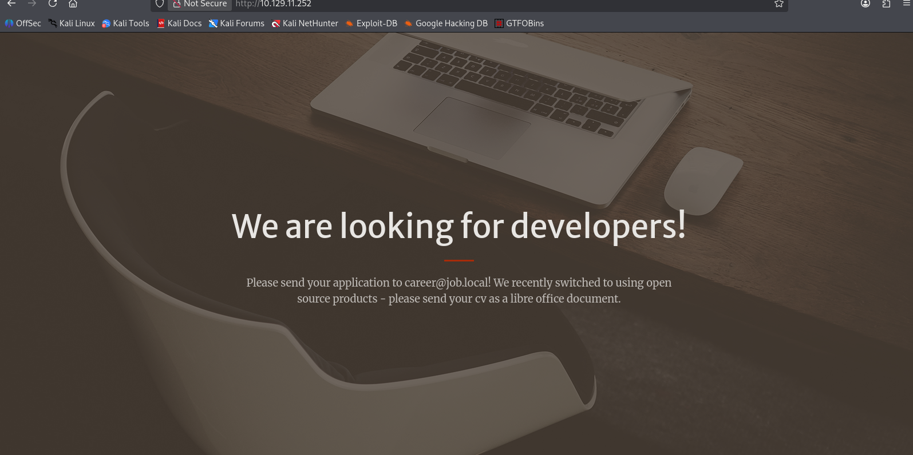

# Notion source and screenshot review

Reviewed 2026-09-24. All nine existing walkthroughs have matching Notion records marked Rooted. This is source reconciliation, not an independent reproduction of the assessments.

| Existing walkthrough | Embedded screenshots returned | Review note |
| --- | --- | --- |
| [Bizness](./bizness.md) | 0 | Text evidence; image attachments not returned |
| [Browsed](./browsed.md) | 0 | Text evidence; image attachments not returned |
| [Devel](./devel.md) | 0 | Text evidence; image attachments not returned |
| [Facts](./facts.md) | 0 | Text evidence; image attachments not returned |
| [Job](./job.md) | 1 | Careers-page image shown below |
| [Kobold](./kobold-hybrid.md) | 0 | Rooted status, unchecked proof field, report placeholders |
| [Overwatch](./overwatch.md) | 0 | Notion OS property conflicts with Windows/AD narrative |
| [Principal](./principal.md) | 0 | Text evidence; image attachments not returned |
| [Pterodactyl](./pterodactyl.md) | 0 | Text evidence; image attachments not returned |

## Job — careers-page evidence

The original embedded screenshot shows the careers page requesting a LibreOffice-format CV. It supports the document-submission context; it does not independently establish code execution, administrative access, or external SMTP relay. The original lab address is visible in the browser bar; the image contains no visible password or flag. No synthetic or reconstructed evidence was added.

- Source: the newer Rooted Job record in the author's Notion HTB Machines database; the older Job record is marked In progress.
- SHA-256: `b6f6258d2229fd9a7663f5f3016a425e85feeda809b46bc894cf47835da379c6`.
- Publication eligibility: [HTB lists Job as retired](https://www.hackthebox.com/machines/job), checked 2026-09-24.
- The image is stored in the repository, not linked through an expiring attachment URL.

## Narrative corrections needed

- Job: acceptance of mail for a local recipient does not itself establish an open relay to external domains.
- Job: the available screenshot does not establish a particular CVE, macro warning behavior, or whether a person versus automation opened the document.
- Overwatch: resolve the Linux source property against the Windows/AD narrative before reusing the metadata.
- Kobold: reconcile the proof checkbox and unfinished report sections against the recorded Rooted status.

## Remaining publication work

The [queue](./PUBLICATION-QUEUE.md) lists the additional rooted records and screenshot availability. Existing walkthrough bodies were not republished in this update because the upload review identified sensitive material requiring sanitization. No new complete walkthroughs are claimed as published. Before publishing revisions, review credentials, tokens, keys, proof strings, unsupported claims, and screenshot contents. Preserve original evidence privately and publish only a reviewed copy.
